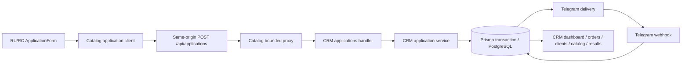

# Business logic audit V2 — Task 2 contract and ownership

**Status:** PASS  
**Scope:** Task 2 only  
**Catalog commit audited:** `659359c987bbb7f8ccb42934b5bce025ce7d58ee`  
**CRM commit audited:** `9e5daa09060b2f531c4b93b85bfd856cfde43d88`  
**Machine-readable contract:** [business-logic-contract-v1.json](business-logic-contract-v1.json)

## Production flow

The database write precedes Telegram delivery. A Telegram failure therefore leaves a persisted request and returns `502 DELIVERY_FAILED`; it does not erase the application. The public catalogue owns neither the CRM database nor Telegram credentials.

## Frozen public request contract

All variants require `type`, `locale`, `firstName`, `lastName`, `phone`, `city`, and literal `consentAccepted: true`. Optional shared fields are `email`, `comment`, `preferredCallTime`, four UTM fields, `entryPoint`, `sessionHistory`, and the empty `website` honeypot. Supported locales are exactly `ru-MD` and `ro-MD`.

| Variant | Variant fields | Semantics |
|---|---|---|
| `order` | `productSlugs`, optional `items[{slug, quantity}]` | 1–20 unique slugs; quantity is an integer from 1 to 99. `items` carries quantity while `productSlugs` retains compatibility. |
| `consultation` | `consultationMode`, `date`, `time` | Mode is `online` or `offline`; date is future `YYYY-MM-DD`, time is `HH:mm`, Moldova time zone applies. |
| `masterclass` | `topic`, `eventDate`, `eventTime` | Topic is one of five shared values; future date/time use the same Moldova semantics. |

The city value comes from the shared list of 36 Moldova regions. Russian region/topic strings are canonical wire tokens; Romanian strings are UI labels. Changing a label is presentation work. Changing a token is an API breaking change.

## Responses and transport bounds

| HTTP | Owner | Stable meaning |
|---:|---|---|
| 201 | CRM | Request persisted and Telegram sent; response includes `requestId` and delivery state. |
| 400 | proxy/CRM | Invalid content type, body, field value, or idempotency-key syntax; CRM may include field errors. |
| 403 | CRM | Origin is not permitted. |
| 405 | proxy/CRM | Method is not permitted. |
| 413 | proxy/CRM | Body exceeds the bounded request size. |
| 429 | CRM | Rate limit reached; `Retry-After` is supplied. |
| 502 | proxy | CRM upstream is unavailable or timed out. |
| 502 | CRM | The request was persisted but Telegram failed; code `DELIVERY_FAILED`. |
| 503 | proxy/CRM | Required runtime configuration is unavailable. |

The catalogue proxy caps the body at 16 KB and the upstream call at 10 seconds. It forwards the idempotency key, origin, and bounded client-address headers, and preserves upstream status/body/content type plus `Retry-After`.

## Enum-like values and identifiers

| Concept | Current values/shape | Canonical owner |
|---|---|---|
| Application type | `order`, `consultation`, `masterclass` | CRM contract; catalogue is producer |
| Order status | `NEW`, `PROCESSING`, `DELIVERY`, `DONE`, `CANCELLED` | CRM |
| Dashboard range | `7d`, `30d`, `90d`, `all` | CRM |
| Product identity | immutable published `slug`; `sku` is secondary | Catalogue |
| Order/request | UUID string | CRM |
| Client | UUID and unique normalized phone | CRM |
| Telegram mapping | unique `telegramMessageId` when present | CRM |

`OrderItem.productSlug` is a copied convention in CRM rather than a database foreign key to catalogue source. Unknown or stale slugs must be rejected or quarantined; they must never be silently mapped to a different product.

## Ownership table

| Shared concept | Canonical owner | Compatibility responsibility |
|---|---|---|
| Published product slug, SKU, localized public content, category, image, publication | Catalogue product dataset | CRM projection must preserve identity. |
| Application schema semantics | CRM handler/shared schema | Catalogue may emit only fields already accepted by CRM. Coordinated copies remain until a separately approved architecture task. |
| Moldova regions and masterclass topics | Coordinated business contract | Both repositories must retain identical wire tokens; locale labels remain repository presentation. |
| Public form, local selection, client validation and attribution capture | Catalogue | Must conform to CRM acceptance and public privacy decisions. |
| Same-origin proxy and CRM endpoint configuration | Catalogue | Must remain a thin transport boundary. |
| Origin, body, schema, rate and idempotency validation | CRM | Server acceptance is authoritative. |
| Prisma schema, migrations, clients, orders, order items | CRM | Catalogue does not import or duplicate persistence code. |
| Telegram delivery, webhook and Telegram-derived status changes | CRM | Catalogue receives only safe delivery results. |
| Internal prices and immutable order price snapshots | CRM | Prices must never appear in public catalogue output. |
| Dashboard/results formulas | CRM | Formula changes require CRM evidence and regression tests. |
| Legal/content/release blocker evidence | Catalogue `docs/release-status.json` | A successful build does not resolve owner/legal blockers. |
| Cross-repository Graphify map | Catalogue `tools/graphify` | Rebuild with `npm run graphify:cross-repo` after cross-repo changes. |

## Drift classification

The two application schema copies are semantically aligned in the audited commits. Present differences are formatting, relative import extension style, and repository-local module paths. Those differences do not change accepted payloads.

Known gaps are tracked as later tasks rather than hidden as “contract drift”: persistent idempotency is absent, rate limiting is process-local, order status/type remain unrestricted database strings, and the application service owns a second Prisma client. No shared package or source refactor is justified or started by Task 2.

## Versioning and compatibility rules

1. Add optional fields to CRM acceptance first; emit them from the catalogue only after that deployment is verified.
2. Required fields, removed fields, enum/token changes, or meaning changes use a two-phase deployment and an explicit contract-version decision.
3. Preserve the previous producer contract for at least one release window unless a security exception is documented.
4. Treat product slugs as immutable after publication.
5. Keep response status and error-code meaning stable; clients must not infer success from a generic 2xx response.
6. Use expand → migrate/backfill → verify → contract for breaking database changes.
7. Do not assume catalogue and CRM deploy atomically.
8. A shared package, new API version, or cross-repository source refactor requires its own approved task.

## Task 2 disposition

**PASS.** The flow, full request/response inventory, enum-like values, identifiers, quantities, ownership, formatting differences, semantic gaps, and compatibility rules are explicit. No production source, schema, data, dependency, or deployment was changed.

The next baseline unit is **Task 3 — Establish migration, rollback, and verification baselines**.
